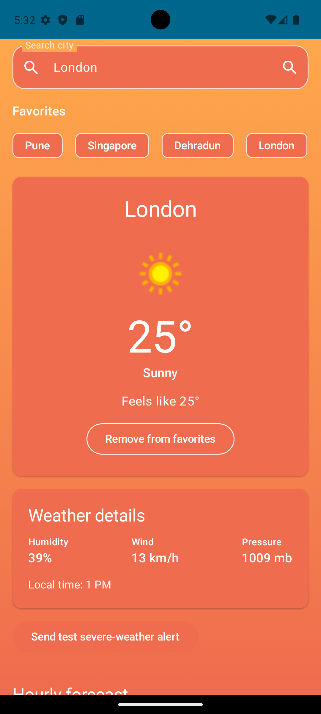
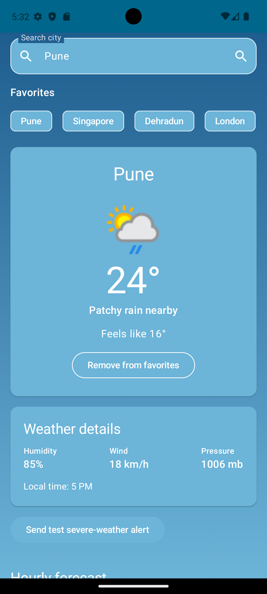
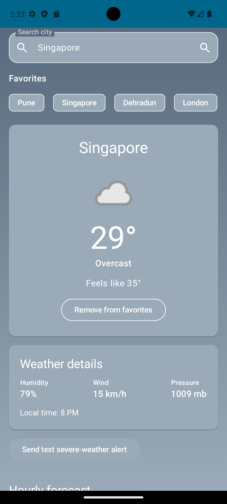

# Weather Intelligence

An offline-first Android weather forecast app built for the Standard Chartered assessment. It shows current conditions, hourly weather, and a seven-day forecast using [WeatherAPI.com](https://www.weatherapi.com/docs/). The interface adapts its palette to the active weather condition.

## Screenshots

| Sunny · London | Rain · Pune | Overcast · Singapore |
| --- | --- | --- |
|  |  |  |

## Architecture

The app follows a clean MVVM structure:

```
Compose UI → HomeViewModel → GetWeatherUseCase → WeatherRepository
                                                   ├─ Room (source of truth)
                                                   └─ Retrofit (WeatherAPI)
```

- **Presentation:** Jetpack Compose, `StateFlow`, lifecycle-aware collection, and dynamic weather palettes.
- **Domain:** `Weather` models, repository contract, and use case.
- **Data:** Retrofit API client, Room entity/DAO, mapping layer, and repository implementation.
- **Dependency injection:** Hilt.

## Offline-first and smart refresh

Room is the app's source of truth. A city forecast is cached with an `updatedAt` timestamp. On a request, the repository refreshes only when the 30-minute TTL has expired (or the user pulls to refresh). If a refresh fails and a cached response exists, the cached forecast is displayed with an offline banner. A first-load network failure is shown as an error state.

`WeatherSyncWorker` schedules a unique six-hour WorkManager job with a network constraint. It refreshes only the cities saved as favorites, avoiding unnecessary API calls for transient searches. WeatherAPI alerts marked **Severe** or **Extreme** are posted as high-priority notifications. Android 13+ requests notification permission when the app first opens.

## Favorites and location fallback

Use **Save to favorites** on the current-weather card to persist a city. Saved cities appear as quick-selection chips at the top of the home screen and are the only cities refreshed by background work. Favorites are stored in Room and therefore remain available after an app restart or while offline.

On launch, the app prefers the current device location. If it is unavailable, it falls back to the last selected favorite, then the most recently added favorite, and finally London.

## Testing notifications

1. Install a **debug** build and accept the notification permission prompt.
2. Load any city, then tap **Send test severe-weather alert**. This button is compiled only into debug builds.

If a notification does not appear, confirm that the app's **Severe weather alerts** channel is enabled in Android system notification settings.

## Setup

1. Create a free API key at [WeatherAPI.com](https://www.weatherapi.com/signup.aspx).
2. Add the key to `local.properties` (this file is not committed):

   ```properties
   WEATHER_API_KEY=your_key_here
   ```

3. Open the project in Android Studio, sync Gradle, and run the `app` configuration on an Android 7.0+ device/emulator.

Or run the checks from the repository root:

```bash
./gradlew :app:testDebugUnitTest
./gradlew :app:assembleDebug
```

The generated APK is located at `app/build/outputs/apk/debug/app-debug.apk`.

## Assumptions and trade-offs

- City search is text based and WeatherAPI resolves the city name.
- Forecast units follow WeatherAPI's default metric response.
- Cache TTL is intentionally conservative (30 minutes) to balance freshness and API usage.
- API keys are injected through `local.properties` or the `WEATHER_API_KEY` Gradle property and are never hard-coded.
- Severe notifications are limited to WeatherAPI alerts whose severity is `Severe` or `Extreme`; notification delivery is subject to Android system-level notification settings.

## Tests

The unit-test suite covers cache TTL behavior, formatting and display policies, weather palettes, repository caching, use-case delegation, and ViewModel startup fallback behavior.
